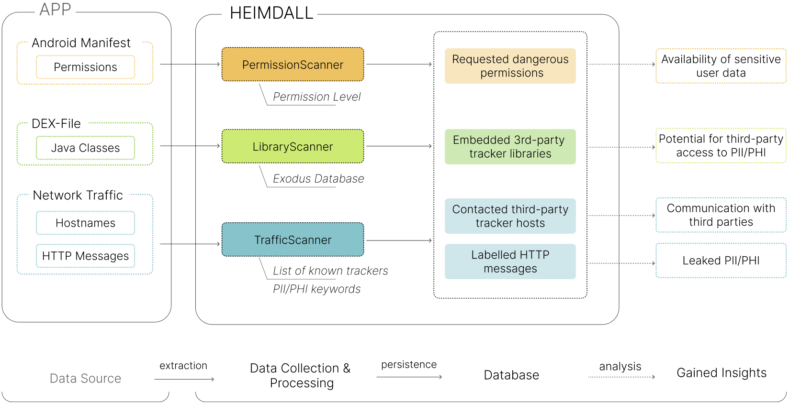

# Heimdall - The Android privacy monitoring toolkit


Heimdall is an advanced toolkit designed to empower researchers, developers, and privacy enthusiasts in analysing and studying the privacy-related behavior of Android applications.
By providing a comprehensive overview of permissions, embedded third-party libraries, and network traffic, Heimdall aims to foster transparency and awareness regarding mobile privacy.

**Heimdall is still under active development, with lots of features and refinements still to come.** 
Feel free to use the [issue tracker](https://github.com/tomcory/Heimdall/issues) if you come across any bugs or have feature requests!

## Features

- **Permission Analysis:** Heimdall helps you to view and analyze the permissions used by installed apps, providing a detailed breakdown of what resources an app may access.
- **Library Detection:** Easily detect embedded third-party libraries and SDKs that may be collecting user data.
- **Network Traffic Monitoring:** Real-time inspection of network traffic to help you identify potential data leakages or suspicious connections.
- **Fully on-device:** Heimdall requires no external infrastructure and does not transmit any data off the device, be it personal or any other kind of data.

## Getting Started

### Prerequisites

- Android SDK version 28 (Android 9) or higher. We're working on making Heimdall compatible with older Android versions.
- Root access is required to decrypt HTTPS traffic of monitored apps. All other features work in standard user space. If you don't need to access the application-layer traffic of monitored apps, there's no need to modify your device in any way.

### Installation

1. Clone this repository:
   ```bash
   git clone https://github.com/tomcory/heimdall.git
   ```
2. Open the project with Android Studio 
3. Build and run the app on your device or emulator

## Use

### Components

Heimdall comprises three Scanners: 

1. `PermissionScanner` - Queries the [`PackageManager`](https://developer.android.com/reference/android/content/pm/PackageManager) API for all permissions requested by (but not necessarily granted to) monitored apps.
2. `LibraryScanner` - Parses the .dex files of monitored apps to extract their package signatures and matches them against the [Exodus Privacy Project](https://exodus-privacy.eu.org/)'s database of third-party tracker signatures to identify trackers embedded in monitored apps.
3. `TrafficScanner` - Leverages the [`VpnService`](https://developer.android.com/reference/android/net/VpnService) API to intercept the network traffic of monitored apps. In standard user space, extracted information is limited to connection metadata, e.g. hostnames and geolocation of remote servers. On rooted devices, the `TrafficScanner` is capable of employing an on-device Man-in-the-Middle (MitM) VPN layer to decrypt HTTPS traffic, thereby granting access to the application-layer data transmitted by monitored apps.

The figure below shows how these scanners extract data from monitored apps, what label sources they employ to label the extracted data and what insights can be gained by analysing the data:



### Man-in-the-Middle VPN

In modern versions of Android, HTTPS is enabled by default, which means that the vast majority of network traffic is TLS-encrypted as it passes through Heimdall's `TrafficScanner`.
Bypassing this encryption requires the use of a MitM attack to hijack the TLS sessions that monitored apps establish with remote hosts. 
his capability is baked into the TrafficScanner in the form of a MitM-VPN layer and can be enabled via the _MitM_ preferences menu.

To function correctly, the MitM-VPN requires a **custom root CA certificate** to be installed on the device.
Since Android 7, user-installed CA certificates are no longer accepted by default, which means that in most cases, the custom CA certificate must be placed in the system CA store for apps to accept it. This generally requires **root access** on the device.

Here's how to install Heimdall's custom CA on a rooted device using [Magisk](https://github.com/topjohnwu/Magisk/releases):

1. Root your device and install Magisk
2. Open Heimdall, navigate to the _MitM_ preferences and select `Generate Magisk Module`
3. Open Magisk and import the generated module
4. Reboot your device and verify that the module is installed correctly

If you are using a rooted device without Magisk, you need to generate Heimdall's CA certificate by navigating to the _MitM_ preferences and selecting `Generate CA certificate` and manually add it to the system CA store located at:
```
system/etc/security/cacerts
```

Once you have installed the custom CA certificate, simply enable the MitM VPN via the _MitM_ preferences and launch the `TrafficScanner`.

### Data export

All data collected by Heimdall is persisted in an on-device SQLite database and can be exported for external analysis in the following formats via the _Export_ screen:
1. SQLite database
2. CSV
3. JSON

## Contributing

Feel free to open a new [issue](https://github.com/tomcory/Heimdall/issues) for bug reports or feature requests. Pull requests for contributions are always welcome!

## Citations

If you use this toolkit in your academic research, please be so kind as to cite our paper introducing Heimdall:

```
@INPROCEEDINGS{9343230,
  author={Cory, Thomas and Raschke, Philip and Küpper, Axel},
  booktitle={2020 IEEE 19th International Conference on Trust, Security and Privacy in Computing and Communications (TrustCom)}, 
  title={Heimdall: Illuminating the Hidden Depths of Third-Party Tracking in Android Applications}, 
  year={2020},
  volume={},
  number={},
  pages={676-682},
  doi={10.1109/TrustCom50675.2020.00094}}

```

## Credits

Heimdall is being developed by a team of researchers and students lead by Thomas Cory at the [Service-centric Networking](https://www.tu.berlin/snet) chair at Technische Universität Berlin.

Early versions of the TrafficScanner employed [LittleProxy-mitm](https://github.com/ganskef/LittleProxy-mitm) to decrypt HTTPS traffic - and the proxy remains an optional feature to supplement the MitM-VPN layer.

Identification of third-party tracking hosts is based on the [unified hosts](https://github.com/StevenBlack/hosts) file curated by Steven Black. Similarly, third-party tracking library identification is based on the database curated by the [Exodus Privacy Project](https://exodus-privacy.eu.org/).
## License
This project is licensed under [GPLv3](https://www.gnu.org/licenses/gpl-3.0.html).